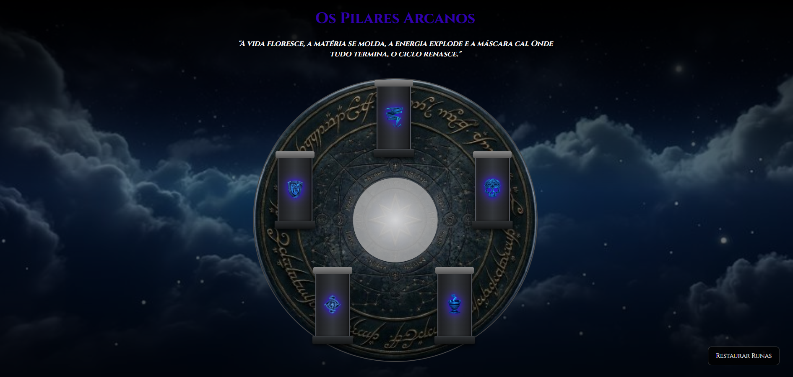

# Os Pilares Arcanos

Um puzzle interativo inspirado em RPGs de fantasia, desenvolvido para campanhas de Tormenta20 e outros cenários medievais.

## Sobre

Esse projeto trata-se de representar um ritual antigo encontrado nas em ruínas ou passagens secretas com magia. O jogador deve interpretar uma frase enigmática e ativar os pilares na ordem correta para provar-se digno de seguir a sua jornada.
Para isso, basta acertar a sequência correta das escolas de magias utilizadas.

Cada escola de magia possui:

* Símbolo próprio
* Efeitos visuais exclusivos
* Efeitos sonoros temáticos
* Feedback visual e narrativo

## Enigma

> "A vida floresce, a matéria se molda, a energia explode e a máscara cai. Onde tudo termina, o ciclo renasce."

## Recursos

* Interface temática medieval/fantasia
* Animações mágicas personalizadas
* Efeitos sonoros para cada escola
* Sistema de progresso visual
* Mensagens narrativas de falha
* Sistema de punições graduais
* Ritual de conclusão
* Reinicialização do puzzle

## Tecnologias

* HTML5
* CSS3
* JavaScript Vanilla

## Objetivo do Projeto

Este projeto foi criado como parte de uma campanha de RPG ambientada no Reino/País de Wynlla, em uma ilha flutuante homebrew nomeada de Lythariel.
A ideia é transformar enigmas tradicionais em experiências interativas que possam ser compartilhadas diretamente com os jogadores durante as sessões.

## Possíveis Evoluções

* Sistema de múltiplos rituais
* Novas escolas de magia
* Efeitos visuais avançados
* Rituais encadeados
* Ritual final combinando todos os enigmas anteriores

## Licença

Projeto criado para fins educacionais, criativos e de entretenimento.

## Jogar agora
https://kevingsousa.github.io/rpg-pillars-puzzle/
